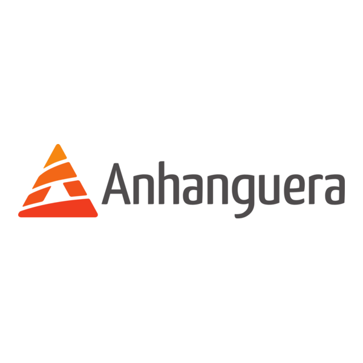
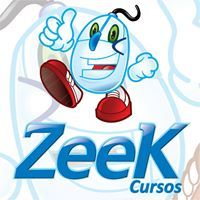

<h1 align="center"> Guilherme Maioli Brito </h1>

<b> JavaScript |  HTML |  CSS |  C# |  Python |  Java |  
 
 
                                                          
<blockquote>
  
<i>
      Entusiasta da área da tecnologia, sempre buscando aprendizado. Sou estudante de Engenharia de Software em desenvolvimento, sou novo na área e busco oportunidades para aprimorar meus conhecimentos.
</blockquote>

---

  
  
  
  

  

  

<strong><i>Sobre mim</i></strong>

---

Olá! Sou Guilherme, apaixonado por tecnologia e em busca de conhecimento e aprimoramento.

O que me motivou à entrar nessa área, foi a criação de jogos, que foi meu primeiro curso realizado sobre a área de software. Agora estou realizando mais cursos para aprimorar meus conhecimentos, junto com minha faculdade.

 
 

<strong><i>Ferramentas</strong>

#### • Linguagens

#### • Banco de Dados

#### • Editores

#### • Game Engines

#### • Sistemas Operacionais

  

<strong>Repositórios Destaques</strong>

 

  
  

<strong><i>Competências</i></strong>
 
  
 

#### • Qualificação Acadêmica
  
---

 

**Anhanguera Educacional**\
[**Anhanguera Educacional**](https://www.anhanguera.com/)

Certificados:

   
  
- [Bacharelado em Engenharia de Software] Conclusão em 2028.

- [Introdução À Linguagem Python](https://drive.google.com/file/d/1D0By_mRXjM4PQd50ymS02xKXh8vCOp6d/view?usp=sharing)

- [Introdução À Análise De Dados Com Python](https://drive.google.com/file/d/1xqzPk0AqxEoz8CX8QsqYbmQUqjnpD1MY/view?usp=sharing)

- [Estruturas De Dados Em Python](https://drive.google.com/file/d/19IwZgJ7oIDLjS8v04PlppT1k4zuF2nRQ/view?usp=sharing)

- [Língua Espanhola I](https://drive.google.com/file/d/1fPnjJYWB0SrIUPh_Q58JWE0O2ckli7po/view?usp=sharing)

- [Língua Espanhola II](https://drive.google.com/file/d/17KGRqb4kYBGLac7Rtq7tOI364_UhL7Cv/view?usp=sharing)

- [Língua Espanhola III](https://drive.google.com/file/d/1s9ZIvOjJq1IFhhy2DMFhNNacuDB3bt0w/view?usp=sharing)

- [Língua Espanhola IV](https://drive.google.com/file/d/1AbELm9qrGKLvJap6m7kwdqib2NB8V6Az/view?usp=sharing)

- [Língua Inglesa I](https://drive.google.com/file/d/16_1cKHIvvo7yd6Oz3m_QTiwfBFbdKOSa/view?usp=sharing)

- [Língua Inglesa III](https://drive.google.com/file/d/1p0c1loNafYpsmfaBAEDk2i1rBeRHDeHk/view?usp=sharing)

 

**Zeek Cursos**\
[**Zeek Cursos**](https://zeekcursos.com.br/)

Certificados:

 

- [Desenvolvedor de Games](https://drive.google.com/file/d/1Xh5I7H_-HEhIA6TR8239-bWUlceO6IGA/view?usp=sharing)

 

**Udemy**\
[**Udemy**](https://www.udemy.com/pt/?srsltid=AfmBOooKUgRGuC2Jl0HRplX-Tm-dgXAdQkvjNRC2aKI9HjoqB0KBbASv)

Certificados:

 

- [JavaScript e TypeScript] Ainda cursando.

- [Inteligência Artificial e Machine Learning] Ainda cursando.

 

**Comunidade da Arte**\
[**Comunidade da Arte**](https://comudaarte.com/)

Certificados:

 
  
- [Arte Digital](https://drive.google.com/file/d/1xTGNpzBIawNkegj87kkdH_EVNmRiR48b/view?usp=sharing)
  
- [Traços de Anime](https://drive.google.com/file/d/1_RtEFFmxgHJMqCLWruPec9wqRAsOlzkK/view?usp=sharing)
  
- [Realismo Simplificado](https://drive.google.com/file/d/1aaJkeYfr4ztbD7aXnOXL8Lk1g57ocm89/view?usp=sharing)
  
- [Maestro da Pintura](https://drive.google.com/file/d/1Ye-jyaSGPdVI3AR941ducFWlvAZuLdml/view?usp=sharing)
  
- [Anatomia em Prática](https://drive.google.com/file/d/17pP8GS0lopZEXSgPWLcXsROOhnN_gnEc/view?usp=sharing)
  
- [Realismo com Lápis de Cor](https://drive.google.com/file/d/1_loGruMzYqWKkC8zjM99-a1Vk-NQKHcX/view?usp=sharing)
  
- [Modelagem em 3D](https://drive.google.com/file/d/1az1FTe5Sq-b9FSZU6svlDIUz6GwDOqF5/view?usp=sharing)
  

  ---
  

<a href="https://github.com/GuilhermeBrito05">

