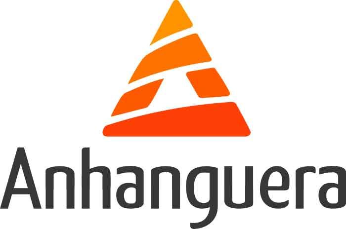

<h1 align="center"> Guilherme Maioli Brito </h1>

<b> JavaScript |  HTML |  C# |  Python | 
 
 
                                                          
<blockquote>
  
<i>
      Entusiasta da área da tecnologia, sempre buscando aprendizado. Sou estudante de Engenharia de Software em desenvolvimento, sou novo na área e busco oportunidades para aprimorar meus conhecimentos.
</blockquote>

---

  
  
  
  

  

  

<strong><i>Sobre mim</i></strong>

---

Olá! Sou Guilherme, apaixonado por tecnologia e em busca de conhecimento e aprimoramento.

O que me motivou à entrar nessa área, foi a criação de jogos, que foi meu primeiro curso realizado sobre a área de software. Agora estou realizando mais cursos para aprimorar meus conhecimentos, junto com minha faculdade.

 
 

<strong><i>Ferramentas</strong>

#### • Linguagens

#### • Banco de Dados

#### • Editores

#### • Game Engines

#### • Sistemas Operacionais

<strong><i>Repositório em Destaque</i></strong>
 

<strong><i>Competências</i></strong>
 
  
 

#### • Qualificação Acadêmica
  
---

 

**Bacharelado em Engenharia de Software**\
[**Anhanguera Educacional**](https://www.anhanguera.com/)

Certificados:

  Ainda não disponível, cursando 4° semestre.
  
  Conclusão: 2028.

 

**Desenvolvimento de Jogos**\
[**Zeek Cursos**](https://zeekcursos.com.br/)

Certificados:

 

- [Desenvolvimento de Jogos]

 

**Udemy**\
[**Udemy**](https://www.udemy.com/pt/?srsltid=AfmBOooKUgRGuC2Jl0HRplX-Tm-dgXAdQkvjNRC2aKI9HjoqB0KBbASv)

Certificados:

JavaScript e TypeScript: Ainda cursando.

Inteligência Artificial e Machine Learning: Ainda cursando.

 

**Comunidade da Arte**\
[**Comunidade da Arte**](https://comudaarte.com/)

Certificados:

Arte Digital: Cenario Fantasia: Ainda cursando.

